# Project Name: Custom PC

## Project Members

| First Name | LAST NAME    | GitHub Username |
|------------|--------------|-----------------|
| Youssef    | Cherkaoui    | Yorkchk         |
| Yasser     | El Mouatadir | yaselmo         |
| Sofia      | El Ouazzani  | Sofiaelouazzani |
| Ismail     | Khayati      | Ismish87        |
| Amine      | Baba         | AmineBaba10     |

## Introduction

The Custom PC project aims to develop a personalized PC ordering application that meets the various needs of users regarding component selection. This system allows users with different roles (Administrator, StoreKeeper, Assembler, and Requester) to interact with the application's features according to their profile, enabling collaborative and structured management.

This deliverable focuses specifically on implementing the functionalities of the Assembler role, allowing them to assemble orders by analyzing order details. It also includes the Requester role, which has the ability to create orders using components available in stock. Then, the Assembler can choose to approve or reject the order.

The functionalities were designed to ensure a smooth and intuitive process while meeting functional and technical requirements. The project also includes the structure and tools necessary for scalable maintenance, such as database initialization and user management.

Our team is committed to delivering a robust and reliable application that follows the specifications and provides an efficient and secure user experience for all stakeholders.

## Requirement Clarifications

### Reformulated Explicit Requirements

- The system must allow the Requester to create an order.
- The system must allow the Requester to view their orders.
- The system must allow the Requester to change the quantity of a component in their order.
- The system must allow the Requester to add components to their order.
- The system must allow the Requester to remove components from their order.
- The system must allow the Requester to delete their order.

- The system must allow the Assembler to view orders to assemble.
- The system must allow the Assembler to reject orders for any reason.
- The system must allow the Assembler to approve orders.
- The system must not approve orders requesting components that are out of stock.

### Proposed Implicit Requirements

<to be completed (optional)>

### Assumptions

<to be completed (optional)>

## Modeling

### Use Case Diagrams (optional)

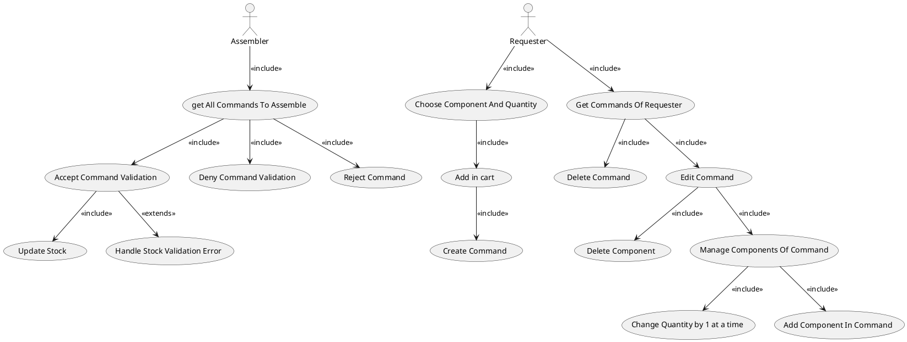

### State Diagrams

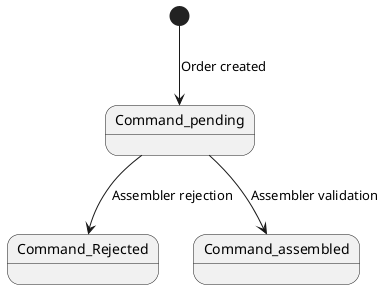

### Requester Sequence Diagrams

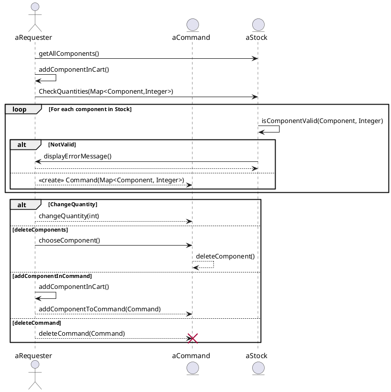

### Assembler Sequence Diagrams

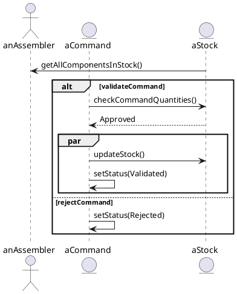

### Orders

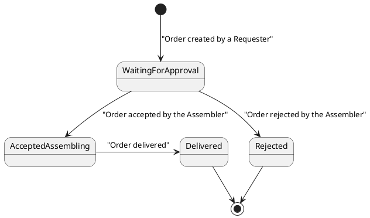

## Activity Diagrams

### Home and Authentication

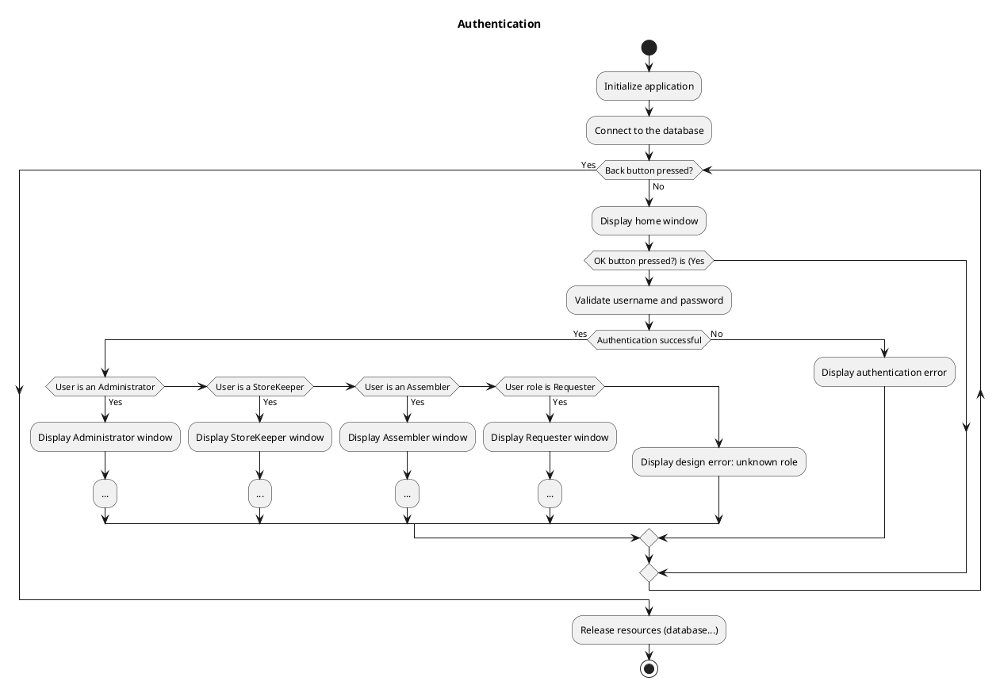

### User Management

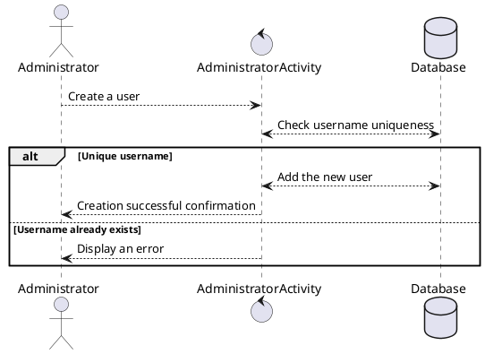

## Error Management

User management includes validations and error messages:

- **Authentication error**: Message displayed when username or password is incorrect.
- **Unauthorized role**: Message displayed if a user tries to access a feature not allowed for their role.
- **Username already exists**: Error displayed when trying to create a user with an existing username.
- **Order quantity exceeds stock quantity**: Error displayed when creating an order containing a component exceeding stock availability.

These measures ensure the application remains secure and user-friendly for all user types.

### Stock Management

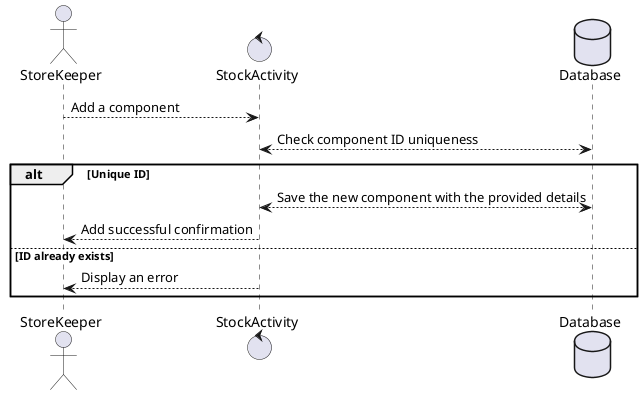

### Placing an Order

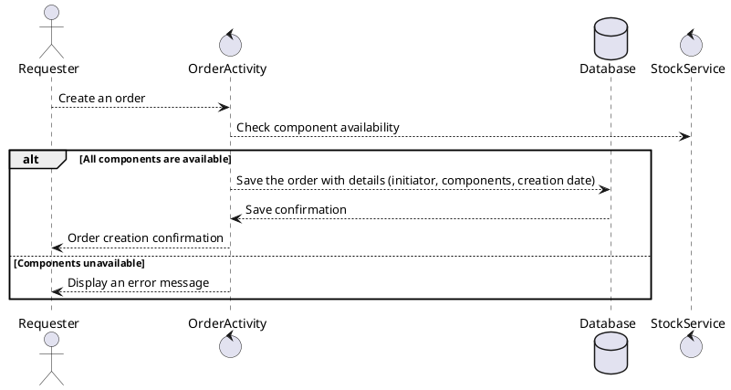

### Processing an Order

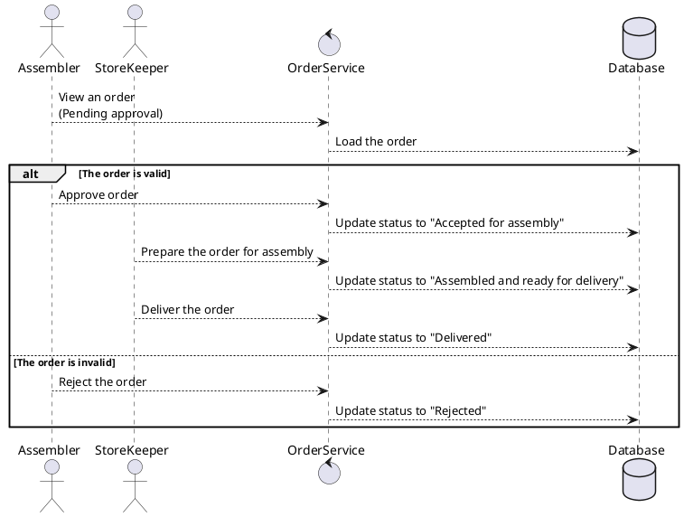

## Sequence Diagrams

### Home and Authentication

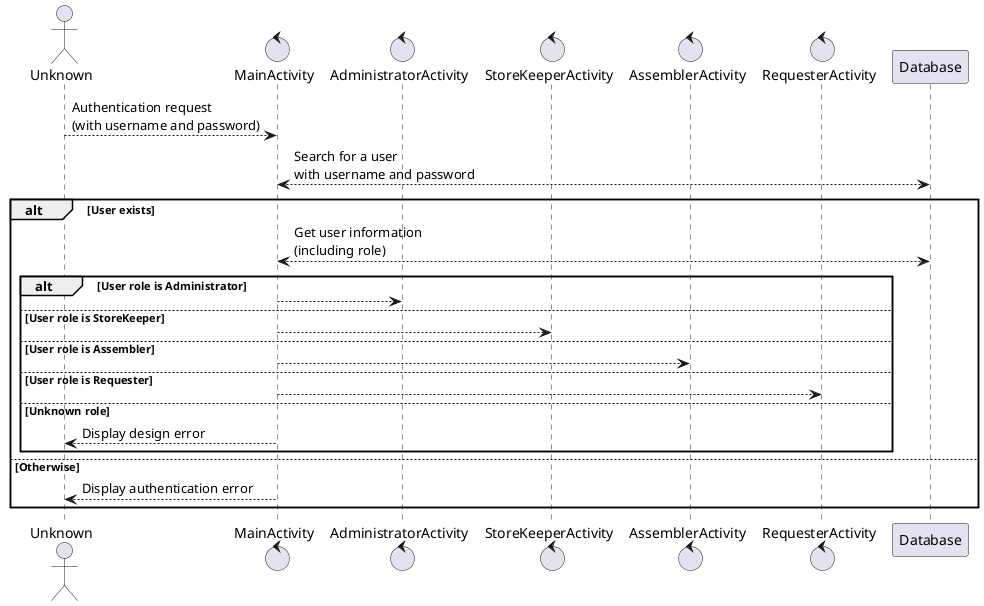

### Administrator Role

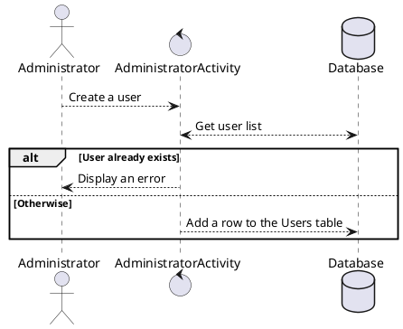

### StoreKeeper Role

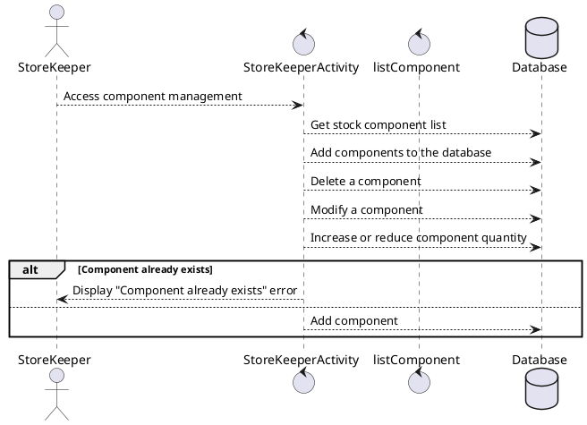

### Assembler Role

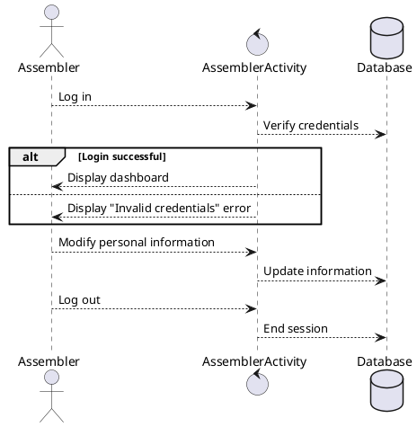

### Requester Role

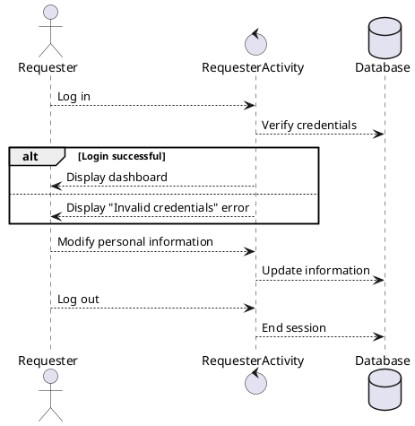

## Design Elements

### System Architecture

The application follows an architecture similar to the MVC (Model-View-Controller) model, where user interfaces communicate with controller classes that manage user interactions. These classes are grouped in the `ui` folder. Then, these classes communicate with other classes containing the business logic specific to the application. These classes also represent the entities participating in the application. Finally, these classes manipulate data by communicating with a Firebase NoSQL database.

### Technological Choices

- Programming Language: Java
- Platform: Android Studio
- Database: Firebase Firestore for real-time data management.

### Database Design

#### Users Table

- username (String)
- password (String)
- role (String, can be "Requester", "StoreKeeper", "Administrator", "Assembler")
- email (String, unique)
- firstName (String)
- lastName (String)

#### Components Table

- type (String)
- subtype (String)
- description (String, unique)
- comment (String, optional)
- creationDate (Timestamp)
- modificationDate (Timestamp)
- quantity (int)

### User Interfaces

The application provides separate interfaces for each role with role-specific functionalities. For example, the Administrator interface includes options to add or remove users, while the StoreKeeper interface allows stock management.

### Error Handling

Appropriate error messages are displayed to the user in case of authentication failure or data update errors. For example, if a user tries to log in with invalid credentials, an error message indicates that the entered information is incorrect.

### Test Values

#### Users

| Role           | Login Identifier             | Password  |
|----------------|------------------------------|-----------|
| Administrator  | yasser@elmouatadir.com       | yasser123 |
| StoreKeeper    | Ismail_Khayati@gmail.com     | Ismail    |
| Assembler      | Sofia_Elouazzani@gmail.com   | sofia123  |
| Requester      | youssef_cherkaoui@gmail.com  | youssef   |

#### Example Data File

You can find XML files containing information about users and components for testing purposes in the `data` folder located at `groupe-8/PCsurmesure/data`.

You can also find the current state of the database in a JSON file in the same folder.

